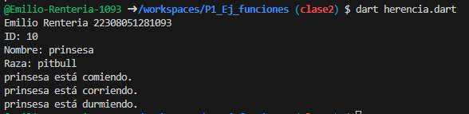

crea una clase animal con los atributos (id_animal, nombre, raza)y una función de comer(). crea otra clase perro con herencia animal con las funciones  correr() y otra dormir(). lenguaje dart

salida de resultados

