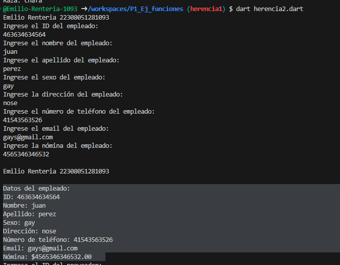
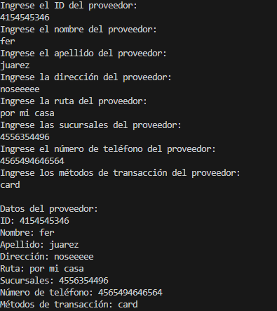

# HERENCIA 

## Tabla Empleados
crear la clase Empleados con los atributos (id_empleados, nombre, apellido, sexo, dirección, num_tel, email, nomina) con una función Capturardatos(), con interacción de interfaz de usuario. crear una clase DatosEmpleados con herencia mascota y una función Mostrardatos(). en lenguaje dart

## Tabla Proveeodres
crear la clase Proveedors con los atributos (id_proveedor, nombre, apellido, dirección, ruta, sucursales, num_tel, metodos_transaccion) con una función Capturardatos(), con interacción de interfaz de usuario. crear una clase DatosProveedor con herencia mascota y una función Mostrardatos(). en lenguaje dart

