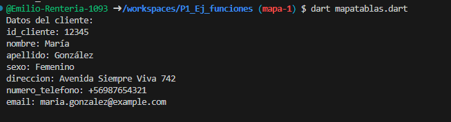
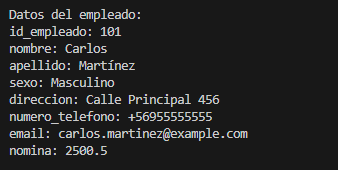
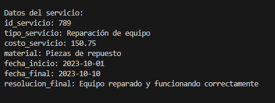

crea un map <string, dynamic> productos con los siguientes key,id cliente, nombre, apellido, sexo, direccion, numero_telefono, email

crea un map <string, dynamic> productos con los siguientes key,id cliente, nombre, apellido, sexo, direccion, numero_telefono, email, y mostrar los datos con el for each. lenguaje dart

crea un map <string, dynamic> productos con los siguientes key,id empleado, nombre, apellido, sexo, direccion, numero_telefono, email, nomina, y mostrar los datos con el for each. lenguaje dart

